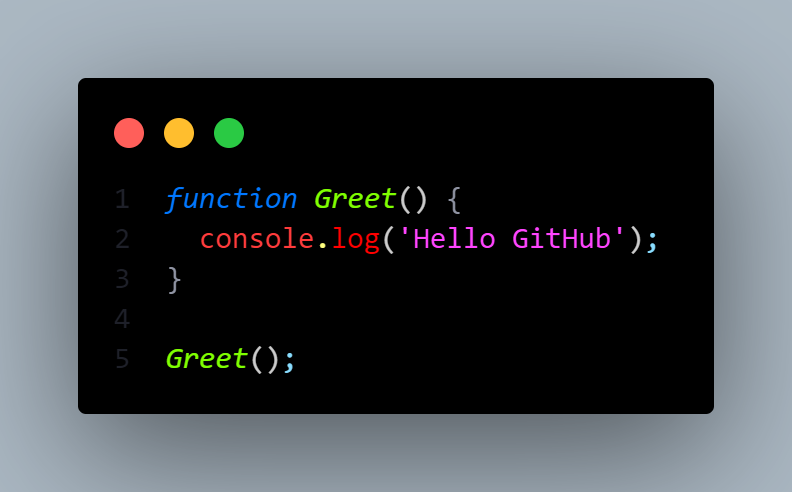

# Welcome to my **JS Course** repo 🙋🏻‍♂️

---

### Eloquent JavaScript

> _There are many terrible mistakes to make in computer programming and the software development world –
> and you should go ahead and make them so that you ***understand*** them. A sense of what a good program looks
> like is developed in practice – not learned from theory or a list of rules._ 😀

---

This repository is going be to be used to track my progress through learning JavaScript fundamentals.

After completing a web dev course on Udemy and jumping into React - I found that whilst I could grasp
the concepts and start to build basic applications, I felt I was lacking some fundamental lanaguage
knowledge of the 3 core languages.

The main reason I could grasp concepts, I believe, is because I already had logical thought patterns
from learning Python. However, without understanding of a language itself, it is still difficult.

I want to know how JavaScript is working under the hood.

---

I compared this to my current job where I manufacture components through offline CNC programming. One can learn
how to use CAM software, program a component, and prove that program on a machine without some background
knowledge of machining. However, problems arise when issues are encountered in that process.

For example:

You could come across a situation where a cutting tool is not achieving the required finish on a component.

There are a 101 reasons why this could be. After 11 years in manufacturing engineering - usually I can spot the issue
within a few seconds.

---

Currently, it's not quite like this for me in coding. 😵‍💫

This is where the skill and background fundamental knowkledge kicks in. Without it - you can find yourself stuck.

I started to feel the same way about using React.

I'm hoping 🤞🏻 a better understanding of JavaScript is going to accelerate my progress - being as React is a JavaScript library.
